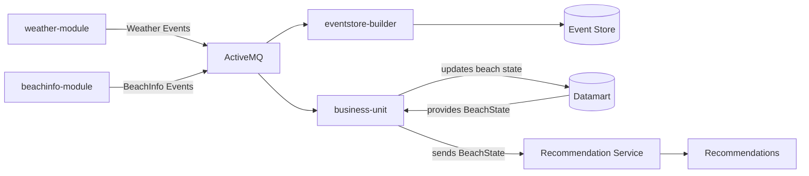

# Task Manager in Python

Simple console task manager built with Python.

## Features
- Add tasks
- Show tasks
- Mark tasks as completed
- Delete tasks
- Delete all tasks
- Show summary
- Save tasks in JSON
- Prevent empty and duplicate tasks

## Technologies
- Python
- JSON
- Git

## How to run
```bash
python main.py
```

## Future improvements
Search tasks
Priorities
Tests

## System Architecture


